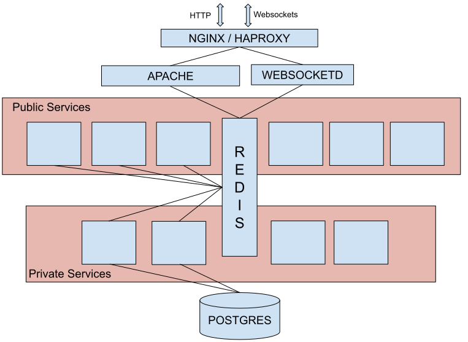

<!-- class: invert -->

<!-- Building: npx @marp-team/marp-cli@latest -w pre-conf-session.md -->

# Getting Started in Evergreen Development

2026 Evergreen Conference

Bill Erickson & Jane Sandberg

[https://github.com/berick/Presentations/tree/main/Evergreen-2026]()

---

# Intro

A brief, practical guide to hacking Evergreen.

---

# Create Development VMs

Brief discussion of options then refer to Blake's `Taming Evergreen` that
afternoon which (I believe) goes into more detail re: building VMs.

---

---

# Architecture Recap

* C / Perl / Angular / IDL / Angular / Services / Redis / Postgres

---

# Debugging Tools

* logs
* srfsh
* ...

---

# 5 minute break

---
# Working with Perl

* Bill fixes a bug

---
# 5 minute break

---
# Working with Angular

* Angular concepts
* Best practices
* Fix a bug
* Fix another bug if we have time

---
# Angular concepts

* Composition: Assembling small, simple building blocks in ways that make sense to users and other developers.
* Service: typescript code that has a basic duty in managing the interface or communicating with the backend.
* Component: A pair of two things: a template and some typescript.  They are connected through bindings.

---
# Two kinds of binding
* Data binding: Binding part of the template to a typescript value so that when the value changes, the screen updates with your new value
* Event binding: Binding an element of the template to some typescript logic so that when a user takes an action, it triggers some typescript code to run
---
# Best practices
* Keep things SIMPLE!
* Each component, service, type, class, function, etc. should do one thing well
* Avoid mutating your variables/use const whenever you can
* As few dependencies as possible
---
# Fixing bugs

1. Consider extracting the offending code into something simpler
1. Write a failing test that captures the issue
1. Edit the code to get the test passing
1. Confirm that the bug is fixed
1. Do any necessary cleanup

---
# Our bug

[Bug 2144600](https://bugs.launchpad.net/evergreen/+bug/2144600):
Course Reserves - Reopen Selected Action Always Grayed Out

---
# Our other bug

[Bug 2145192](https://bugs.launchpad.net/evergreen/+bug/2145192):
No confirmation toast when adding to record bucket from search
